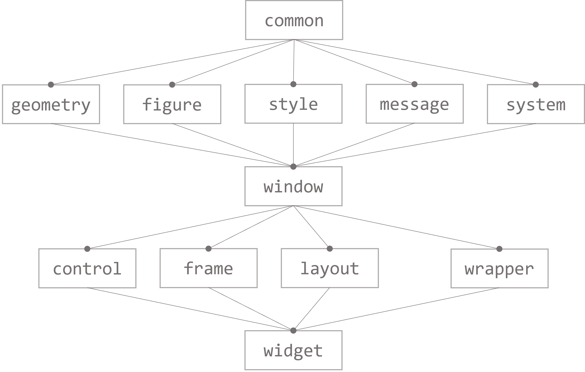
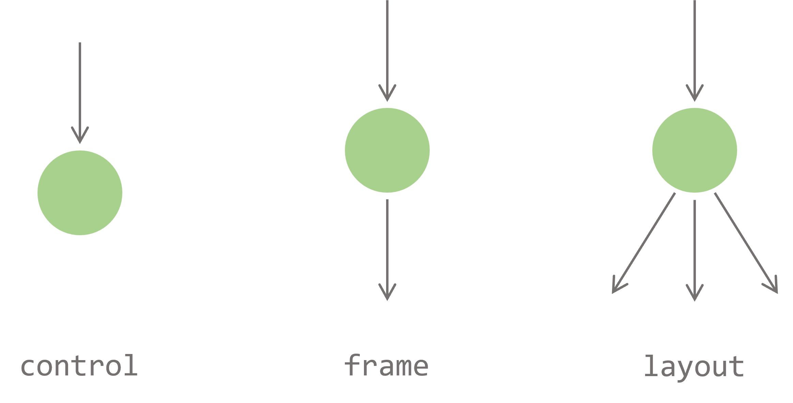
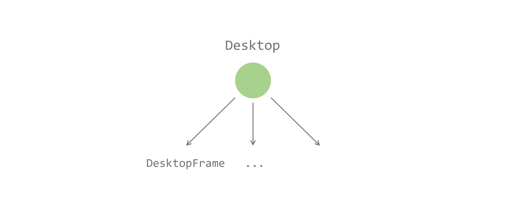

# WndDesign

A C++ GUI library

## Quick Start

*for Windows 10/11 systems only*

* Install Visual Studio 2022, check **Desktop development with C++**.

* Clone `WndDesign` source code.

* Click open `WndDesign.sln`, set `Test` as startup project, build, and run.

## Code Structure

There are two projects contained within the `WndDesign` solution:
* `WndDesign`: main source code, builds to a static library `WndDesign.lib`.
* `Test`: test examples, builds to an executable windows application `Test.exe`.

### WndDesign

Folder-level dependencies are roughly shown in the graph below:

The content of each folder is summarized as follows:

#### common

Defines some basic macros, types, helper functions, and `namespace WndDesign`.

#### geometry

Defines basic 2D geometry objects, `Point`, `Vector`, `Size` and `Rect`.

#### figure

Defines `Line`, `Rectangle`, `RoundedRectangle`, `Ellipse`, `Image` and `TextBlock` that can be drawn on the screen.

#### style

Defines styles of a window.

#### message

Defines mouse, keyboard and timer messages.

#### system

Defines `Win32` and `DirectX` system interfaces.

#### window

Defines the `WndObject` base class and `Desktop` root window object.

#### control

Defines control components like `Button`, `Textbox`, `ImageBox` and `Scrollbar`.

#### frame

Defines frame components like `BorderFrame`, `PaddingFrame`, `ScrollFrame`, `ScaleFrame`, and `LayerFrame`.

#### layout

Defines layout components like `ListLayout`, `FlowLayout`, `SplitLayout` and `OverlapLayout`.

#### wrapper

Defines window decorators like `SolidColorBackground`.

#### widget

Defines complex window components including `ScrollBox` and `TitleBarFrame`.

### Test

Defines test examples for most components in `WndDesign` project.

## Concepts

### Window Tree

#### WndObject

A window, or `WndObject`, is the basic unit that draws figures and handle messages.

Each `WndObject` may have none, one, or multiple child windows, and each `WndObject` may have only one parent window.

All `WndObject` with child windows and parent windows form a *window tree*.

A *window tree* example with its runtime screenshot:

#### Control, Frame and Layout

Controls, Frames and Layouts are all `WndObject` but they play different roles in the *window tree*.

##### Control

Controls are `WndObject` that have no child window, so they are always leaf nodes in the *window tree*. Controls include `Button`, `TextBox`, `EditBox`, `ImageBox`, `Scrollbar` and `Placeholder`. They are often used to handle user inputs or display simple figures.

##### Frame

Frames are `WndObject` that have one child window. Frames include `BorderFrame`, `PaddingFrame`, `ScaleFrame`, `ClipFrame`, `ScrollFrame` and `LayerFrame`. They are often used to decorate a window with border or padding, or change the window's resizing or drawing behaviour.

##### Layout

Layouts are `WndObject` that may have multiple child windows. Layouts include `SplitLayout`, `ListLayout`, `FlowLayout`, `BarLayout` and `OverlapLayout`. They are often used to display complex data structures.

#### Desktop

`Desktop` is the root `WndObject` in the *window tree*.

`DesktopFrame` is the direct child window of `Desktop`. Each `DesktopFrame` displays an overlapped window on desktop.

### Window Layout

The layout of a `WndObject` is how its contents or child windows are organized and how their relative positions and sizes are calculated.

#### 1D Geometry

##### Position

`position` is a signed value relative to the origin point.

##### Length

`length` is an unsigned value indicating the length of a line segment.

#### 2D Geometry

##### Point

`Point` is a pair of position values `x` and `y`, which is always relative to a specific window. The upper-left corner of a window is usually taken as the origin point (0, 0).

##### Size

`Size` is a pair of length values `width` and `height`. 

##### Rect

`Rect` is a pair of `Point` and `Size` that represents a rectangular region. It is also relative to a specific window.

##### Vector

`Vector` is the difference between two `Point`s. It can be applied to a `Point` or a `Rect` as a translation transform.

#### Layout Type

Layout type indicates how a window's width or height will change according to its parent window's width or height. It is just a compile time contract.

There are three kinds of layout types for both horizontal and virtical dimensions, `Assigned`, `Auto` and `Relative`.

##### Assigned

Indicates the width or height of a window is assigned by its parent window.

##### Auto

Indicates the width or height of a window is independent of its parent window, and is probably dependent on its contents or child windows.

##### Relative

Indicates the width or height of a window is dependent on its parent window but is not strictly assigned by its parent window. 

### Figure

`Figure` can be drawn on a window.

All figures inherits `Figure` base class, and are rendered to a `RenderTarget` in a callback virtual function `DrawOn()`. 

Rendering is finally implemented by Direct2D, a Windows built-in library. A `RenderTarget` is a kind of Direct2D object to create resources and perform actual drawing operations.

#### Redraw

Redraw happens when a window is created or its displaying contents have changed. A rectangle region of the window is invalidated and propogated to its parent windows til `DesktopFrame`. 

##### FigureQueue

A `FigureQueue` is a collection of `Figure`s. It will be passed to the window by reference in the `OnDraw()` callback function to collect `Figure`s the window wishes to draw. It can also apply translation or other complex transformations to a group of figures. `FigureQueue` is finally drawn on `Layer`.

##### Layer

`Layer` is where `Figure`s are rendered on. A `Layer` draws a `FigureQueue` at a time. `Layer` itself is also a kind of `Figure` that can be drawn on other `Layer`s.

Each `DesktopFrame` owns a `DesktopLayer` coupled with a `HWND` resource, and is directly managed by `Desktop`. All `Figure`s are finally drawn on `DesktopLayer` and presented on screen.

### Message Handling

All messages, including `Timer` callback are synchornized, which means all messages are processed sequentially. The next message will only be dispatched after the current message is fully handled.

#### Mouse Messages

Mouse messages contain a message type, key state and current mouse position relative to the window.

Mouse messages are first hit-tested with `HitTest()` callback function and then dispatched to the destination child window after a point transform.

##### Mouse Track

##### Mouse Capture

#### Keyboard Messages

#### Notification Messages

Notification messages has no parameter, and currently only includes `MouseEnter`, `MouseHover`, `MouseLeave` and `LoseFocus` that are triggered by mouse or keyboard message dispatchers.

