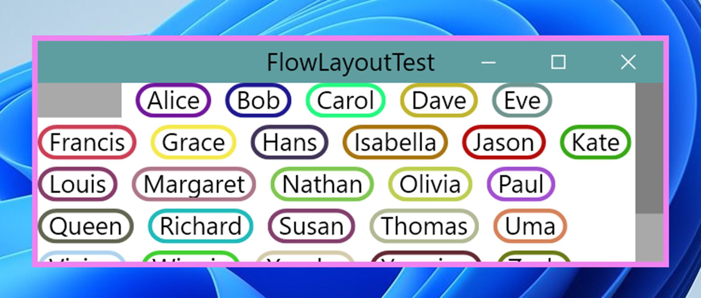
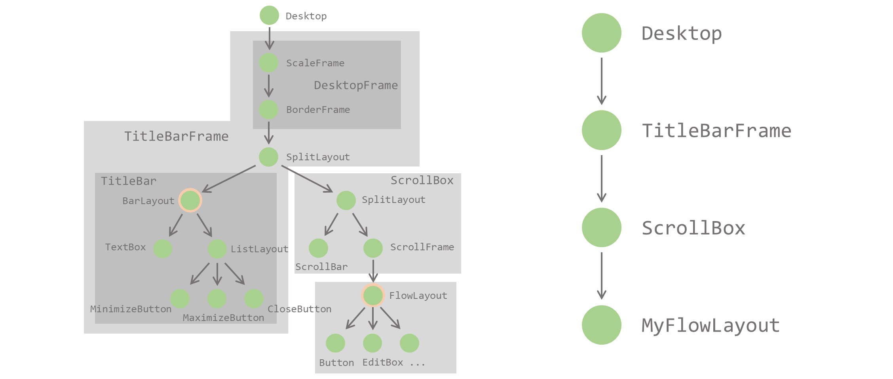
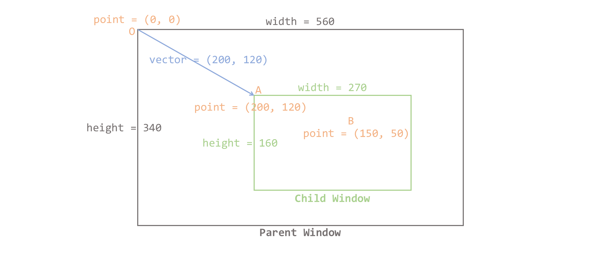
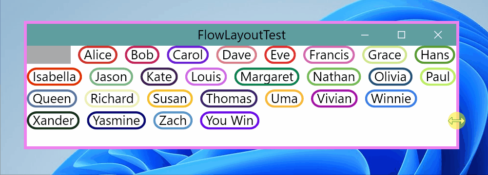
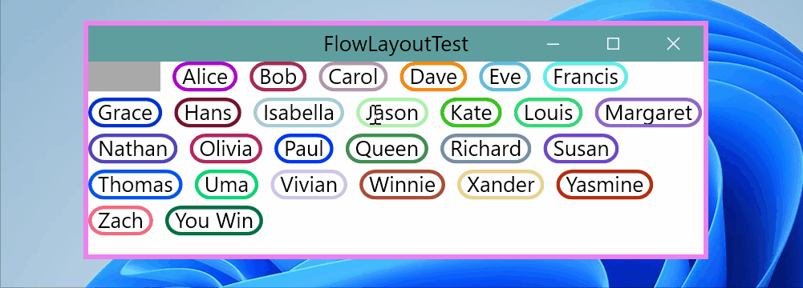
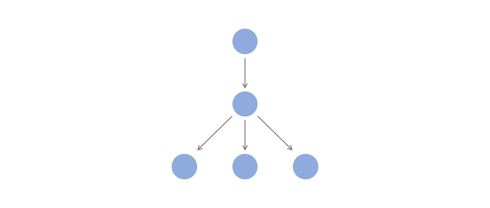

# WndDesign

A C++ GUI library

## Quick Start

*for Windows 10/11 systems only*

* Install Visual Studio 2022, check **Desktop development with C++**.

* Clone `WndDesign` source code.

* Click open `WndDesign.sln`, set `Test` as startup project, build, and run.

## Code Structure

There are two projects contained within the `WndDesign` solution:
* `WndDesign`: main source code, builds to a static library `WndDesign.lib`.
* `Test`: test examples, builds to an executable windows application `Test.exe`.

### WndDesign

Folder-level dependencies are roughly shown in the graph below:

#### common

Defines some basic macros, types, helper functions, and `namespace WndDesign`.

#### geometry

Defines basic 2D geometry objects and their operations, mainly including `Point`, `Vector`, `Size` and `Rect`. 

#### figure

Defines `Line`, `Rectangle`, `RoundedRectangle`, `Ellipse`, `Image` and `TextBlock` that can be drawn on the screen.

#### style

Defines styles that are used by `TextBlock` or other components.

#### message

Defines mouse, keyboard and timer messages.

#### system

Provides `Win32` and `DirectX` interfaces for window rendering, message handling and other system interactions like clipboard or IME management.

#### window

Defines the `WndObject` base class and `Desktop` root window object. `WndObject` is the core component of this project.

#### control

Defines some basic control components such as `Button`, `Textbox`, `ImageBox` and `Scrollbar`.

#### frame

Defines some basic frame components like `BorderFrame`, `PaddingFrame`, `ScrollFrame`, `ScaleFrame`, and `LayerFrame`.

#### layout

Defines some layout components like `ListLayout`,c`FlowLayout`, `SplitLayout` and `OverlapLayout`.

#### wrapper

Defines some window decorators like `SolidColorBackground`.

#### widget

Provides some pre-defined complex window components that are combination of those basic window components. Currently includes `ScrollBox` and `TitleBarFrame`.

### Test

Defines some Test.h files that serve as both develop examples and test cases. Each test example can be tried out by removing the preceding comment mark `//` from its corresponding `#include<>` line in `test.cpp`.

## Concepts and Implementation

### Window Hierarchy

Window object, or `WndObject`, is a basic unit that draws figures and handle messages.

A window object may have none, one, or multiple child windows, and each window may only have one parent window.

All window objects, along with their child windows and parent windows, form a *window tree*, which is just like the DOM tree in web browsers.

A runtime screenshot of the test example `FlowLayoutTest` is shown below along with its main window hierarchy components:

#### Control, Frame and Layout

Controls, Frames and Layouts all derive from `WndObject` base class and play different roles in the window tree.

##### Control

Controls are `WndObject` that have no child window, so they are leaf nodes in the *window tree*. They are often used to handle user inputs or display simple figures, like `Button`, `TextBox`, `EditBox`, `ImageBox`, and `Placeholder`. A `Placeholder` only occupies a region with a certain size and doesn't draw anything.

##### Frame

Frames are `WndObject` that each owns only one child window. They are often used to decorate a window with border, padding, or change the window's resizing or drawing behaviour. Frames include `BorderFrame`, `PaddingFrame`, `ScaleFrame`, `ClipFrame`, `ScrollFrame`, `LayerFrame` etc.

All Frames inherit class `WndFrame` which then inherits `WndObject`. `WndFrame` provides the simpliest implementation for managing a child window. A window wrapped only with `WndFrame` behaves the same way as the window itself.

##### Layout

Layouts are `WndObject` that may contain multiple child windows, which are used to display complex data structures in different ways. For example, `SplitLayout` represent a pair of windows that may be placed in horizontal or vertical direction, `ListLayout` or `FlowLayout` a list of windows. `OverlapLayout`'s child windows are placed in order and one can overlap on another.

#### Wrapper

Wrappers are decorator templates that inherite a window and override some of its virtual functions. For example, `SolidColorBackground` will override the window's `OnDraw` callback function to fill a solid color in its background before the window's content is drawn.

Both Frames and Wrappers can be used to decorate a window. A Frame and its child window are distinct window objects in the window tree, while a Wrapper and its wrapped window are exactly the same window object.

#### Desktop

`Desktop` is the root window object who has no parent window. `Desktop` globally manages all windows and provides system interfaces.

`DesktopFrame` is the direct child window of `Desktop` that each owns a win32 `HWND` resource. `DesktopFrame` is also called the *root-level* window in this documentation.

`DesktopFrame` actually derives from `ScaleFrame` and contains a `BorderFrame` which then wraps the child window. `ScaleFrame` applies a scale transform to its descendent, which is used by `DesktopFrame` to handle DPI change. Previously `DesktopFrame` only derives from `BorderFrame` to add a resizable border to its child window.

#### Client Region

Unlike traditional win32 or web development, each window object is the minimum unit in the *window tree*. There is no such concept like client region, or css box model. The border, padding, margin or scrollbar of a window are usually implemented with Frames or Controls, which are all seperate window objects. Nevertheless, they can still produce the same effect through proper combination.

### Layout

The layout of a window is its size, along with its content or child window's size and position relative to the window. Here 'layout' does not refer to the layout components mentioned above.

#### Geometry

2D geometric objects and their operations such as point translation, vector addition, rectangle enlarging and size scaling, are essential for layout calculation.

All geometry objects use `float` to store position or length values. In fact, `int` and `uint` were adopted in earlier versions, until high DPI display and scale transformation were introduced in the lastest version.

Below is a picture showing the basic geometry information of a window and its child window:

##### Position and Length

In simple 1D geometry, `position` is a signed value relative to the origin point, and `length` is an unsigned value indicating the length of a line segment.

##### Point

`Point` contains a pair of position values `x` and `y`. A `Point` is always relative to a certain coordinate system. The upper-left point of a window is usually taken as the origin point (0, 0).

For example, the child window's upper-left corner lies at `Point(200, 120)` in the parent window's coordinate system. And `Point(150, 50)` relative to the child window is `Point(350, 170)` relative to the parent.

##### Size

`Size` contains a pair of length values `width` and `height` that should never be negetive.

##### Rect

`Point` and `Size` form a rectangle, namely `Rect`. `Rect` represents a rectangular region. An `Rect` is also relative to a coordinate system because its 2D position is determined by `Point`.

##### Vector

`Vector` indicates the difference between two `Point`s. It can be applied to a `Point` or a `Rect` as a translation transform.

#### Reflow

Layout calculation logic might be the most interesting and complicated part as it took me the most time to finally find a neat design solution. Re-calculating layout is also called the `reflow` process.

Each window is aware of its own size and its content layout. A window's content includes all its child windows and their sizes and positions, or its raw content if it has no child window, like `TextBox` or `ImageBox`. Child window's position relative to its parent window is always kept by the parent and never exposed to the child window itself.

A window's size may be dependent on its parent window's size or its content size. For example, when you drag the border of a text editor to make it thinner, the text will probably be wrapped to a new line because the width is shortened, but its height is extended and a scrollbar may appear to be able to navigate to the hidden content. A similar behaviour happens on `FlowLayout`, as is shown below in the same `FlowLayoutTest` example:

Sometimes a window's width and height are both assigned by its parent window, so the parent window already knows its child window's size information. Sometimes parent window only assigns the width of its child, but requires the child to calculate its height and return it back. Sometimes the child window calculates its size independently and returns both width and height to its parent window.

All these reflow conditions are handled by only two virtual functions, `OnSizeRefUpdate()` and `OnChildSizeUpdate()`. `OnSizeRefUpdate()` goes top-down, which is initiated by parent window calling `UpdateChildSizeRef()`, while `OnChildSizeUpdate()` goes bottom-up and is initiated by child window calling `SizeUpdated()`.

A window receives a size reference, or `size_ref` from its parent window when `OnSizeRefUpdate()` is called. This information, along with the window's style, content and child windows' size, are all needed for calculating its current size. After its size is determined, the parent window's size will be finally determined, and the grand-parent window's size, and so on.

If a window's size is recalculated due to its content change, it will notify its parent window on its current size. Parent window's `OnChildSizeUpdate()` will be called and the parent window's size will in turn be recalculated and grand-parent window may be further informed.

The animation below shows the size calculation order of the windows in a *window tree*. A blue node indicates the window's size is old, green means the size is calculating, and orange means the size is calculated. The window first updates all its child windows' size_ref and gets their updated sizes, then calculates its own size, and finally informs its parent window.

#### LayoutType

`LayoutType` is a compile-time contract to indicate how a window's width or height will change relative to parent window's width or height, to help ensure the consistency of reflow behaviour between child and parent window. Actual size calculation still needs to be implemented.

There are three kinds of layout traits for both horizontal and virtical dimensions: `Assigned`, `Auto` and `Relative`. A window can inherit 

##### Assigned

If the width of a window is `Assigned` by its parent window, its actual width is expected to be the same as `size_ref.width` that parent window provides. So is the height.

If both width and height of a window are `Assigned`, the window will be expected to never call `SizeUpdated()` and its parent window will never respond to `OnChildSizeUpdate()`.

##### Auto

If the width of a window is `Auto`, the window does not refer to `size_ref.width` but calculates the width independently. So is the height.

If both width and height are `Auto`，the window's parent will call `UpdateChildSizeRef()` with an empty `size_ref` only for getting the child window's size, and the window will coorespondingly ignore `size_ref` and only return its size when `OnSizeRefUpdate()` is called. 

##### Relative

If the width of a window is `Relative`, the window will calculate its width based on `size_ref.width` provided by its parent and return the actual width to its parent.

#### Examples

##### Placeholder

`Placeholder` provides the simplest implementation of a window that handles size change events.

##### TextBox

`TextBox` is a pre-defined control who has `LayoutType<Relative, Auto>` and implements left-to-right, top-to-bottom text layout. It will ignore `size_ref.height` and regard `size_ref.width` as the max width when calculating layout. It returns the actual width and height the text content occupies.

##### ClipFrame

Below is an animation showing a `TextBox` wrapped by `ClipFrame` in the `TextBoxTest` example. The outer gray rectangle outlines the region of `ClipFrame`, while the inner black rectangle outlines the region of `TextBox`.

##### ScrollFrame

##### SplitLayout

##### ListLayout

### Paint

Each window can paint

#### Figure

All figures inherits `Figure` base class, and are rendered to a `RenderTarget` in a callback virtual function `DrawOn()`. 

Rendering is finally implemented by Direct2D, a Windows built-in library. A `RenderTarget` is a kind of Direct2D object to create resources and perform actual drawing operations.

##### Shape

An `Ellipse` figure is drawn on a `RenderTarget`, whose center is located at `Point(500, 300)` relative to the `RenderTarget`.

##### TextBlock

##### Image

#### Redraw

Redraw happens when a window is created or its displaying contents have changed. A rectangle region of the window is invalidated and propogated to its parent windows til `DesktopFrame`. 

##### FigureQueue

A `FigureQueue` is a collection of `Figure`s. It will be passed to the window by reference in the `OnDraw()` callback function to collect `Figure`s the window wishes to draw. It can also apply translation or other complex transformations to a group of figures. `FigureQueue` is finally drawn on `Layer`.

##### Layer

`Layer` is where `Figure`s are rendered on. A `Layer` draws a `FigureQueue` at a time. `Layer` itself is also a kind of `Figure` that can be drawn on other `Layer`s.

Each root-level window, or `DesktopFrame` owns a `DesktopLayer` coupled with a `HWND` resource, and is directly managed by `Desktop`. All `Figure`s are finally drawn on `DesktopLayer` and presented on screen.

### Message Handling

All messages, including `Timer` callback are synchornized, which means all messages are processed sequentially. The next message will only be dispatched after the current message is fully handled.

#### Mouse Messages

Mouse messages contain a message type, key state and current mouse position relative to the window.

Mouse messages are first hit-tested with `HitTest()` callback function and then dispatched to the destination child window after a point transform.

##### Mouse Track

##### Mouse Capture

#### Keyboard Messages

#### Notification Messages

Notification messages has no parameter, and currently only includes `MouseEnter`, `MouseHover`, `MouseLeave` and `LoseFocus` that are triggered by mouse or keyboard message dispatchers.

#### Timer

`Timer` receives a callback function as its constructor argument, and can be set to invoke the callback periodically.

## Develop Guide

### C++ Programming Style

This project targets C++20, and all codes follow the conventions below:

#### Namespaces

Namespaces are declared with `BEGIN_NAMESPACE()` and `END_NAMESPACE()` macros. Anonymous namespace uses the empty `Anonymous` macro.

#### Pointers

Raw pointers `T*` are never explicitly used. They are used only when necessary and should be wrapped with either `ref_ptr<T>` or `alloc_ptr<T>` to indicate its ownership. Smart pointers like `std::unique_ptr<T>` or `std::shared_ptr<T>` should be used in most cases.

#### Virtual Functions

Virtual functions are defined with `virtual` keyword. Pure virtual functions ends with `pure` macro which expands to `= 0`. An overrided virtual function should also have `virtual` keyword and should be followed by the `override` specifier.

### Program Startup

`WndDesign` static library already defined the win32 entrypoint `WinMain()` in `system\win_main.cpp`. It does some necessary initialization work and then calls the main function `int main()` that should be defined in user code.

Typically in user's `main()` function, it is expected that the main frame is created and registered via `global.AddWnd()`, as all test examples show. Then `global.MessageLoop()` should be called to enter win32 message loop and wait for messages to process.

`Global` is actually a wrapper for `Desktop` and exposes only a few interfaces for managing root-level windows. `Desktop` is only used in the static library internally and not meant to be exposed to user.

When the last root-level window is destroyed, the win32 message loop will break and the program ends. By explicitly calling `global.Terminate()` the program can also be ended.

### Window Definition

Each window is defined as a class that inherites `WndObject`, overriding some of its virtual functions to implement custom sizing, drawing, or message processing logics.

All virtual functions are callback functions driven by incoming messages.

### Style Definition

`ValueTag` allows 

### Child Window Management

Each window can only be registered by one parent window. Only after registration can a window be added to the *window tree* to receive messages and display contents. Parent window registers a child window by its reference, `WndObject&`.

Parent window can actually own the child window's resource with a `unique_ptr<WndObject>`. This technique is used across almost all examples, which makes it easier to define window tree.

