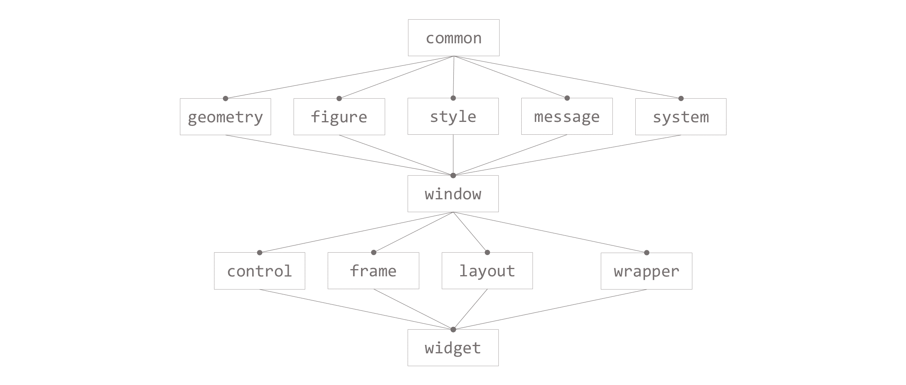
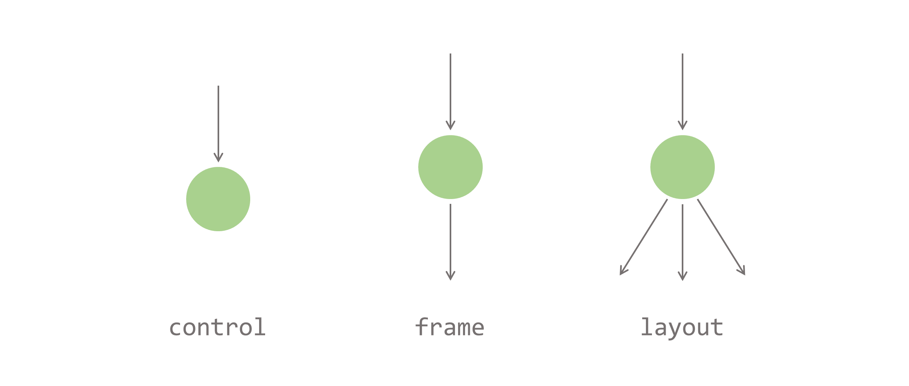

# WndDesign

A C++ GUI library

## Quick Start

* Install Visual Studio 2022, check **Desktop development with C++**.

* Clone `WndDesign` source code.

* Click open WndDesign.sln, set `Test` as startup project, build, and run.

## Code Structure

There are two projects under the `WndDesign` solution:
* `WndDesign`: main source code, builds to a static library `WndDesign.lib`.
* `Test`: test examples, builds to an executable application `Test.exe`.

### WndDesign

Folder-level dependencies are roughly shown in the graph to help one form an overall impression, although precise dependencies should be more complex.

The main contents of each folder are also summarized below.

#### common

Defines some basic macros, namespaces, types, and helper functions.

#### geometry

Defines basic 2D geometry objects and their operations, including `Point`, `Vector`, `Size` and `Rect`. 

#### figure

Defines `Line`, `Rectangle`, `RoundedRectangle`, `Ellipse`, `Image` and `TextBlock` that can be drawn on the screen.

#### style

Defines styles that are used by `TextBlock` or other components.

#### message

Defines mouse, keyboard and timer messages.

#### system

Provides `Win32` and `DirectX` interfaces for window rendering, message handling and other system interactions like clipboard or IME management.

#### window

Defines the `WndObject` base class and `Desktop` root window object. `WndObject` is the core component of this project.

#### control

Defines some basic control components such as `Button`, `Textbox`, `ImageBox` and `Scrollbar`.

#### frame

Defines some basic frame components like `BorderFrame`, `PaddingFrame`, `ScrollFrame`, `ScaleFrame`, and `LayerFrame`.

#### layout

Defines some layout components like `ListLayout`,c`FlowLayout`, `SplitLayout` and `OverlapLayout`.

#### wrapper

Defines some window decorators like `SolidColorBackground`.

#### widget

Provides some pre-defined complex window components that are combination of those basic window components. Currently includes `ScrollBox` and `TitleBarFrame`.

### Test

Defines some Test.h files that serve as both develop examples and test cases. Each test example can be tried out by removing the preceding comment mark `//` from its corresponding `#include<>` line.

## Concepts

### Window Hierarchy

Window object, or `WndObject`, is a basic unit that draws figures and handle messages.

A window object may have none, one, or multiple child windows, and each window may only have one parent window.

All window objects, along with their child windows and parent windows, form a *window tree*, which is just like the DOM tree in web browsers.

A runtime picture of the test example `FlowLayoutTest` is shown below along with its main window hierarchy components:

#### Control, Frame and Layout

Controls, Frames and Layouts all derive from `WndObject` base class and play different roles in the window tree.

Controls are `WndObject` that have no child window, so they are leaf nodes in the *window tree*. They are often used to handle user inputs or display simple figures, like `Button`, `TextBox`, `EditBox`, `ImageBox`, and `Placeholder`. A `Placeholder` only occupies a region with a certain size and doesn't draw anything.

Frames are `WndObject` that each has only one child window. They are often used to decorate a window with border, padding, or change the window's resizing or drawing behaviour. Frames include `BorderFrame`, `PaddingFrame`, `ClipFrame`, `ScrollFrame`, `ScaleFrame`, `LayerFrame` etc. All Frames inherits class `WndFrame` which derives from and has implemented all basic virtual functions of `WndObject`. A window wrapped only with `WndFrame` behaves the same way as the window itself.

Layouts are `WndObject` that may contain multiple child windows, which are used to display complex data structures in different ways. For example, `SplitLayout` represent a pair of windows that may be placed in horizontal or vertical direction, `ListLayout` or `FlowLayout` a list of windows. `OverlapLayout`'s child windows are placed in order and one can overlap on another.

#### Wrapper

Wrappers are decorator templates that inherite a window and override some of its virtual functions. For example, `SolidColorBackground` will override the window's `OnDraw` callback function to fill a solid color in its background before the window's content is drawn.

Both Frames and Wrappers can be used to decorate a window. A Frame and its child window are distinct window objects in the window tree, while a Wrapper and its wrapped window are exactly the same window object.

#### Desktop

`Desktop` is the root window object who has no parent window. `Desktop` globally manages all windows and provides system interfaces.

`DesktopFrame` is the direct child window of `Desktop` that each owns a win32 `HWND` resource.

`DesktopFrame` actually derives from `ScaleFrame` and contains a `BorderFrame` which then wraps the child window. `ScaleFrame` applies a scale transform to its descendent, which is used by `DesktopFrame` to handle DPI change. Previously `DesktopFrame` only derives from `BorderFrame` to add a resizable border to its child window.

### Layout

The layout of a window is its size, along with its content or child window's size and position relative to the window.

#### Geometry

2D geometric operations such as point translation, vector addition, rectangle enlarging, size scaling, are frequently used throughout the project.

All geometry structures use `float` to store length or position values. In fact, `int` and `uint` were used before, until high DPI display and scale transformation were taken into consideration. 

##### Point

`Point` contains a pair of position values `x` and `y`. A `Point` is always relative to a fixed coordinate system. For example, a window's upper-left corner lies at `Point(100, 100)` relative to its parent window. An `Ellipse` figure is drawn on a `RenderTarget`, whose center is located at `Point(500, 300)` relative to the `RenderTarget`.

##### Vector

`Vector` represents the difference between two `Point`s. It can be applied to a `Point` or a `Rect` as a translation transform. 

##### Size

`Size` contains a pair of values `width` and `height` that should never be negetive.

##### Rect

`Point` and `Size` form a rectangle, namely `Rect`. `Rect` represents a rectangular region. An `Rect` is also relative to a coordinate system because its position is determined by `Point`.

#### Layout

Each window is aware of its own size and its content's layout. A window's content includes all its child windows' size and position, or its figure content's layout if it has no child window like `TextBox`. So a window's position relative to its parent window is always kept by its parent and never exposed to the window itself. Only one exception is between `OverlapLayout` and its child `OverlapFrame`, where `OverlapFrame` keeps the `Rect` region on its parent `OverlapLayout`, but this is only for design simplicity.

A window's size may be dependent on its parent window's size or its content's size. For example, when you drag the side of a text editor to make it thinner, the text block's width is shortened exactly the same length as the window's width but its height is extended due to the reflow of the text.

There are two functions designed to handle all reflow conditions: `OnSizeRefUpdate()` and `OnChildSizeChange()`. A window receives `size_ref` from its parent window. This information, along with the window's current style, content and child windows, are all needed for its size calculation. After its current size is determined and returned to its parent window, the parent window's size will be finally determined.

#### LayoutType

`LayoutType` is used to indicate how a window's width or height will change relative to parent window's width or height. It is just a compile-time contract to help ensure child window and parent window's reflow behaviours are consistent. Actual size calculation still needs to be implemented.

There are three kinds of layout types for both horizontal and virtical dimensions: `Assigned`, `Auto` and `Relative`.

I will only talk about the honrizontal dimension `width` in below sections for simplicity. It is exactly the same for `height`.

##### Assigned

If the width of a window is `Assigned` by its parent window, its actual width is expected to be the same as `size_ref.width` that parent window provides.

If both width and height of a window are `Assigned`, the window will be expected to never call `SizeChanged()` and its parent window will leave `OnChildSizeChange()` empty.

##### Auto

##### Relative

#### Reflow

Reflow happens when a window's size is changed due to mouse dragging, content editing, or parent window's resizing. The layout of the window may be recalculated and the content may be further redrawed.

Windows react differently to resize events. Some windows' size may change exactly according to mouse's current drag position and reorgnizes its content, like `FlowLayout`, while some windows' size may remain the same, and the content is clipped out of scene or a scrollbar is displayed.

The rather complex example `FlowLayoutTest` shows different reactions to resize events. The 

### Paint

Each window can paint

#### Figure

All figures inherits `Figure` base class, and are rendered to a `RenderTarget` in a callback virtual function `DrawOn()`. 

Rendering is finally implemented by Direct2D, a Windows built-in library. A `RenderTarget` is a kind of Direct2D object to create resources and perform actual drawing operations.

##### Shape

##### TextBlock

##### Image

#### Redraw

Redraw happens when a window is created or its displaying contents have changed. A rectangle region of the window is invalidated and propogated to its parent windows til `DesktopFrame`. 

##### FigureQueue

A `FigureQueue` is a collection of `Figure`s. It will be passed to the window by reference in the `OnDraw()` callback function to collect `Figure`s the window wishes to draw. It can also apply translation or other complex transformations to a group of figures. `FigureQueue` is finally drawn on `Layer`.

##### Layer

`Layer` is where `Figure`s are rendered on. A `Layer` draws a `FigureQueue` at a time. `Layer` itself is also a kind of `Figure` that can be drawn on other `Layer`s.

Each root level window, or `DesktopFrame` owns a `DesktopLayer` coupled with a `HWND` resource, and is directly managed by `Desktop`. All `Figure`s are finally drawn on `DesktopLayer` and presented on screen.

### Message Handling

All messages, including `Timer` callback are synchornized, which means all messages are processed sequentially. The next message will only be dispatched after the current message is fully handled.

#### Mouse Messages

Mouse messages contain a message type, key state and current mouse position relative to the window.

Mouse messages are first hit-tested with `HitTest()` callback function and then dispatched to the destination child window after a point transform.

##### Mouse Track

##### Mouse Capture

#### Keyboard Messages

#### Notification Messages

Notification messages has no parameter, and currently only includes `MouseEnter`, `MouseHover`, `MouseLeave` and `LoseFocus` that are triggered by mouse or keyboard message dispatchers.

#### Timer

`Timer` receives a callback function as its constructor argument, and can be set to invoke the callback periodically.

## Develop Guide

### Program Startup

`WndDesign` static library already defined the win32 entrypoint `WinMain()` in `WndDesign\system\win_main.cpp`. It does some necessary initialization work and then calls the main function `int main()` that should be defined in user code.

Typically in `main()` function, it is expected that the main frame is created and registered via `global.AddWnd()`, as all test examples show. Then `global.MessageLoop()` should be called to enter win32 message loop and wait for messages to process.

### Window Definition

Each window is defined as a class that inherites `WndObject`, overriding some of its virtual functions to implement custom sizing, drawing, or message processing logics.

All virtual functions are callback functions driven by incoming messages.

### Style Definition

`ValueTag` allows 