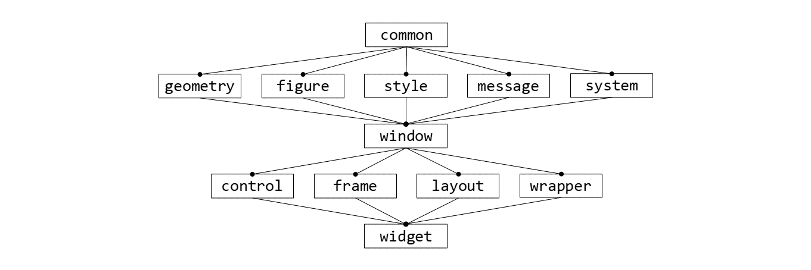

# Code Structure

There are two projects contained within the `WndDesign` solution: `WndDesign` and `Test`.

## WndDesign

Contains the main source code and builds to a static library `WndDesign.lib`.

The folder-level dependencies are roughly shown in the graph below:

The content of each folder is summarized as follows:

### common

Defines some basic macros, types, helper functions, and `namespace WndDesign`.

### geometry

Defines basic 2D geometry objects, `Point`, `Vector`, `Size` and `Rect`.

### figure

Defines `Line`, `Rectangle`, `RoundedRectangle`, `Ellipse`, `Image` and `TextBlock` that can be drawn on the screen.

### style

Defines styles of some specific types of figures or windows.

### message

Defines mouse, keyboard and timer messages.

### system

Defines `Win32` and `DirectX` system interfaces.

### window

Defines the `WndObject` base class and `Desktop` root window object.

### control

Defines control components like `Button`, `Textbox`, `ImageBox` and `Scrollbar`.

### frame

Defines frame components like `BorderFrame`, `PaddingFrame`, `ScrollFrame`, `ScaleFrame`, and `LayerFrame`.

### layout

Defines layout components like `ListLayout`, `FlowLayout`, `SplitLayout` and `OverlapLayout`.

### wrapper

Defines window decorators like `SolidColorBackground`.

### widget

Defines complex window components that are built upon those simple components, currently including `ScrollBox` and `TitleBarFrame`.

## Test

References `WndDesign` project, defines use examples for some components and builds to an executable application `Test.exe`.
