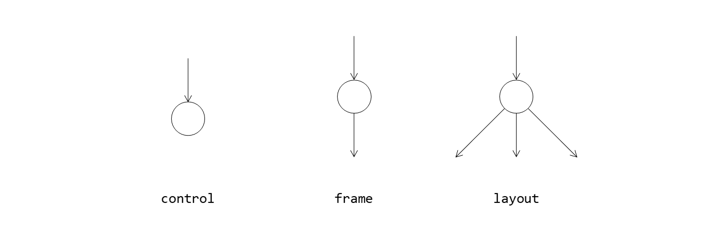

# Concepts

## Window Tree

### WndObject

A window, or `WndObject`, is the basic unit for drawing and message handling.

Each window may have no, one, or multiple child windows and only one parent window.

All windows form a *window tree*.

### Control, Frame and Layout

Controls, Frames and Layouts are the three kinds of windows that play different roles in the *window tree*.

#### Control

Controls have no child window, so they are always leaf nodes in the *window tree*. Controls include `Button`, `TextBox`, `EditBox`, `ImageBox`, `Scrollbar`, `Placeholder`, etc. They are often used to handle user inputs or draw simple figures.

#### Frame

Frames have one child window. Frames include `BorderFrame`, `PaddingFrame`, `ScaleFrame`, `ClipFrame`, `ScrollFrame`, `LayerFrame`, etc. They are often used to decorate a window with border, padding, or other resizing or drawing effects.

#### Layout

Layouts may have multiple child windows. Layouts include `SplitLayout`, `ListLayout`, `FlowLayout`, `BarLayout`, `OverlapLayout`, etc. They are often used to display complex data structures.

### Desktop

`Desktop` is the root node in the *window tree*, and `DesktopFrame` is the direct child window of `Desktop`. Each `DesktopFrame` displays an overlapped window on the desktop.

## Geometry

### 1D Geometry

#### Position

`position` is a signed value relative to the origin point.

#### Length

`length` is an unsigned value indicating the length of a line segment.

### 2D Geometry

#### Point

`Point` is a pair of position values `x` and `y` relative to an origin point. The upper-left corner of a window is usually taken as the origin point (0, 0).

#### Size

`Size` is a pair of length values `width` and `height`. 

#### Rect

`Rect` is a pair of `Point` and `Size` that represents a rectangular region relative to an origin point.

#### Vector

`Vector` is the difference between two `Point`s. It can be applied to a `Point` or a `Rect` as a translation transform.

## Window Layout

The layout of a window is how its contents or child windows are organized, that is, how their relative positions and sizes are calculated.

There are three kinds of layout types that indicate how a window's width or height will change according to its parent window's width or height: `Assigned`, `Auto` and `Relative`.

#### Assigned

Indicates the width or height of a window is assigned by its parent window.

#### Auto

Indicates the width or height of a window is independent of its parent window, and is probably dependent on its contents or child windows.

#### Relative

Indicates the width or height of a window is dependent on its parent window but is not strictly assigned by its parent window.

## Drawing

A window draws figures in its rectangular region. Figures include `Line`, `Rectangle`, `RoundedRectangle`, `Ellipse`, `Image`, `TextBlock`, etc.

## Message Handling

A window may respond to user input or timer messages. User input messages include mouse messages like `LeftDown` and `RightUp`, keyboard messages like `KeyDown` and `KeyUp`, and notification messages like `MouseLeave` and `LoseFocus`.
