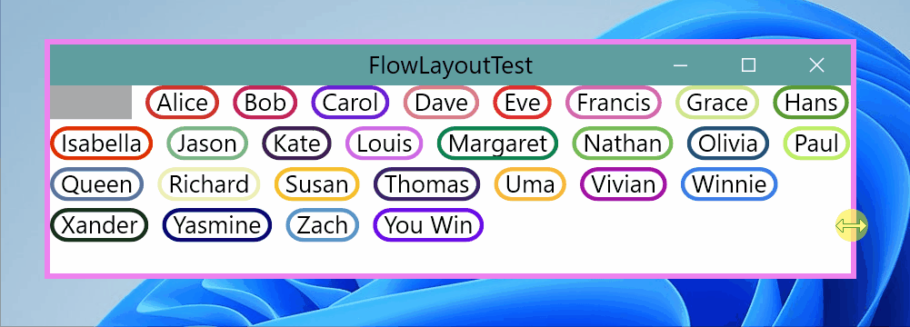
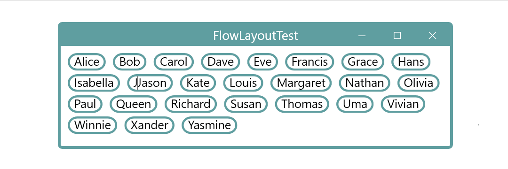
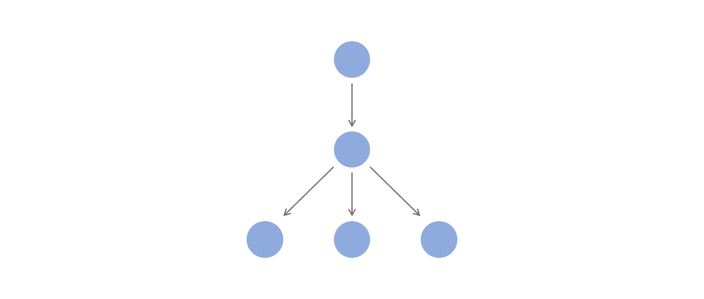

# Implementation

## Environment

This project is entirely written in modern C++. Currently it relies on Win32 APIs as its system interface, but it is not strictly bound to the Win32 APIs and has its own design principles.

## Window Tree

A parent-child relation is established when parent window calls `WndObject::RegisterChild(WndObject& child)` to register a window as its child window. Only after registration can a window become part of the *window tree* to receive messages and draw content.

The child window will save a reference to its parent window as well as a 8-byte `parent_data` field which parent window can use to store indexing information for its child windows.

Each window can only be owned by one parent window at a time. The parent window must call `WndObject::UnregisterChild(WndObject& child)` before another window can register this window as a child. But in most cases, a window will only be registered once through out its lifetime.

## Geometry

All position or length values are stored in `float` to support high DPI display and scale transformation. They will eventually be converted to integer values when rendered in pixels on the screen.

## Layout Calculation

The layout calculation process might be the most complicated part of this project.

Each window is aware of its own size and the layout of its content. A window's content includes all its child windows along with their sizes and positions, or its raw content if it has no child window, like `TextBox` or `ImageBox`. A child window's position relative to its parent window is always kept by the parent and never exposed to the child window itself.

A window's size may be dependent on its parent window or its content or both. For example, when you drag the border of a text editor to change its width, the text will probably be wrapped to new lines causing its height to extend and a scrollbar to appear. When you simply insert more text, the height may also extend.

A similar behaviour happens with `FlowLayout`, as shown in the animations below:

There are two virtual callback functions for `WndObject` to support all sorts of layout calculation scenarios, `OnSizeRefUpdate()` and `OnChildSizeUpdate()`. `OnSizeRefUpdate()` propagates size information top-down the window tree, from parent to child, while `OnChildSizeUpdate()` propagates bottom-up, from child to parent.

The main layout calculation process is, parent window calls `UpdateChildSizeRef()` to send a reference size, or `size_ref` to a child window, which will invoke the child window's `OnSizeRefUpdate()` callback, and the child window calculates its actual size base on the `size_ref` and returns this size to the parent window. If the child window's size is later updated due to its content change but not the `size_ref` change, it calls `SizeUpdated()` and the parent window will get notified by the `OnChildSizeUpdate()` callback to adjust its layout.

The animation below shows the size calculation order of windows in a *window tree*. A red node means its size is calculating, and black means the size is calculated. The window in the center first updates all its child windows' `size_ref` and gets their actual sizes, then calculates its own layout and size, and finally informs its parent window.

## Drawing

Each window draws its content in response to `OnDraw()` callback. It adds the figures it has to draw to the `figure queue`, and if it has child windows, it calls `DrawChild()` to collect its child windows' figures, which invokes the child window's `OnDraw()` callback.

When the content of a window changes, the window calls `Redraw()` to notify its parent window of its dirty region that needs to be redrawn. The parent window will respond in `OnChildRedraw()` callback to pass this dirty region to its own parent window until `DesktopFrame`.

### Figure

All figures inherits `Figure` base class, and are rendered to a `RenderTarget` in a callback virtual function . 

Rendering is finally implemented by Direct2D, a Windows built-in library. A `RenderTarget` is a kind of Direct2D object to create resources and perform actual drawing operations.

#### Shape

An `Ellipse` figure is drawn on a `RenderTarget`, whose center is located at `Point(500, 300)` relative to the `RenderTarget`.

#### TextBlock

#### Image

Redraw happens when a window is created or its displaying contents have changed. A rectangle region of the window is invalidated and propagated to its parent windows til `DesktopFrame`. 

### FigureQueue

A `FigureQueue` is a collection of `Figure`s. It will be passed to the window by reference in the `OnDraw()` callback function to collect `Figure`s the window wishes to draw. It can also apply translation or other complex transformations to a group of figures. `FigureQueue` is finally drawn on `Layer`.

#### Offset

#### Group

A figure group has a 

### Layer

`Layer` is where `Figure`s are rendered on. A `Layer` draws a `FigureQueue` at a time. `Layer` itself is also a kind of `Figure` that can be drawn on other `Layer`s.

### DesktopLayer

Each root-level window, or `DesktopFrame` owns a `DesktopLayer` coupled with a `HWND` resource, and is directly managed by `Desktop`. All `Figure`s are finally drawn on `DesktopLayer` and presented on screen.

## Message Handling

With the win32 message loop, all message and `Timer` callbacks are synchronized. The next callback will only be invoked after the current callback returns.

All these virtual function callbacks are eventually driven by messages dispatched from `Desktop`, `DesktopFrame` and other lower-level windows.

### Mouse Messages

Mouse message contains the message type and current mouse position relative to the window.

#### Hit Test

After a window receives a mouse message, it should first determine whether the message is to be handled by itself or to be further processed by any of its child windows. This process is called 'Hit Test`.

Mouse messages are first hit-tested with `HitTest()` callback function and then dispatched to the destination child window after a point transform.

#### Mouse Track

Before receiving a mouse message, the window will firstly be notified with a `NotifyMsg::MouseEnter`,

#### Mouse Capture

After a window acquires the mouse capture, all subsequent mouse messages are directly sent to this window.

### Keyboard Messages

#### Keyboard Focus

### Notification Messages

Notification messages has no parameter, and currently only includes `MouseEnter`, `MouseHover`, `MouseLeave` and `LoseFocus` that are triggered by mouse or keyboard message dispatchers.

### Timer

`Timer` receives a callback function as its constructor argument, and can be set to invoke the callback periodically.

